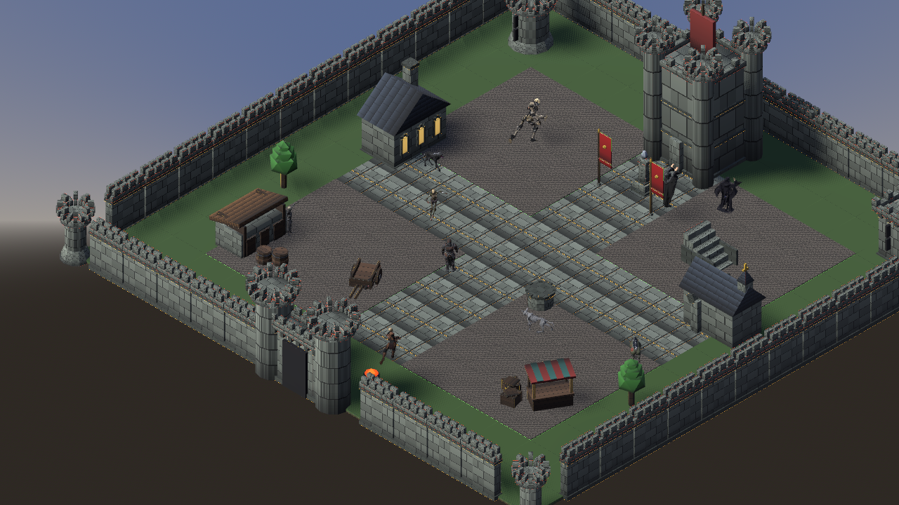

# GrimForge Playable Demo

A playable isometric castle-courtyard scene assembled entirely from GrimForge
kit assets: castle tiles/buildings from **castle_kit_grimforge_v1**, populated
with wandering **grimforge_bestiary_v1** creatures, and a player-controlled
**revenant knight** (sword-armed, with idle/walk/run animation) from
**arsenal_kit_grimforge_v1**.



## Run

```
godot --path products/grimforge_playable_demo_v1
```

(Godot 4.6+, native ufbx import — no Blender round-trip.)

## Controls

| Key | Action |
|---|---|
| Arrow keys | Move the knight (camera-relative, isometric) |
| Hold Shift | Run |

The knight carries a sword and plays walk / run cycles while moving, idle when
stopped. Buildings, walls, and props are solid.

## Three connected worlds

Walk the knight into a doorway to travel between scenes (main.gd is a world
router that frees + rebuilds the world and respawns the player):

- **Courtyard** — the castle courtyard (start).
- **Keep interior** — walk into the keep's door to enter a great hall; walk
  back out the hall entrance to return.
- **Village town** — walk out the south gatehouse onto a road that leads to a
  village; walk back up the road to return.

## Scene contents

- **Environment** (`scripts/env.gd`): measured-pitch tile grid (cobble court,
  flagstone cross paths, grass ring), a seamless perimeter wall ring with
  corner towers + gatehouse, and grid-aligned buildings (keep, great hall,
  chapel, stable, market stall, well) whose doors face the courtyard paths.
  Isometric orthographic camera (35 deg pitch / 45 deg yaw).
- **Bestiary** (`scripts/bestiary.gd` + `scripts/npc.gd`): 13 NPCs that wander
  — walk to random waypoints near home, then rest playing an idle/flavor clip.
  11 are mobile (7 bipeds + 4 quadrupeds); lich_king + skeleton_mage are
  stationary idlers (their AccuRIG rigs failed Unity's humanoid auto-map).
- **Player** (`scripts/player.gd`): CharacterBody3D; idle rig with walk + run
  clips merged at runtime (track-prefix remapped), plus an arsenal-kit sword
  attached to the right-hand bone via BoneAttachment3D.
- **Keep interior** (`scripts/interior.gd`): a great hall from castle-kit parts
  — flagstone floor, windowed walls, pillar aisle, dais with a throne idol.
- **Village town** (`scripts/town.gd`): a village from village_kit_grimforge_v1
  — a road spine to a square (well/market), houses/tavern/blacksmith/church
  facing the road, fences/lampposts/trees. Its own atlas (row-normalized to
  kill grass stripes).
- **World router** (`scripts/main.gd`): `_build_world(name, spawn)` swaps
  worlds; Area3D exit triggers (polled per frame) detect the player at each
  doorway. Test a world directly with `--interior` or `--town`.

## Asset provenance

- Castle pieces: `products/castle_kit_grimforge_v1/models_glb/` (copied into
  `kit/`). Two demo-side patches, kit untouched: `atlas_color_fixed.png`
  row-normalizes baked gradients in the floor swatches (they tile into
  stripes otherwise), and `env.gd` rebuilds meshes with per-face normals
  (kit GLBs ship smoothed normals that pillow-shade flat surfaces).
- Bestiary bipeds: `products/grimforge_bestiary_v1/_anim_viewer/chars/`
  (AccuRIG rigs, Unity Humanoid retarget, binary FBX, Godot native ufbx).
- Quadrupeds: `products/grimforge_bestiary_v1/_quad_viewer/quads/*_v2.glb`.
- Knight locomotion: idle = shared Mixamo set; walk = ActorCore
  `walk-relaxed-loop-378936`; run = ActorCore Run Forward — all baked onto the
  AccuRIG knight rig in Unity (`_tools/bake_*_locomotion.cs`) and exported as
  binary FBX. NPC walk clips baked the same way (`bake_batch_locomotion.cs`).
- Sword: `products/arsenal_kit_grimforge_v1/models_glb/sword.glb` (copied into
  `weapons/`), attached to `CC_Base_R_Hand`.

## Verification harness

CLI flags after `--` for scripted checks: `--shot=name.png[:delay]`,
`--quit-after=S`, `--drive=S` / `--drive=up+left:S` / `--run` (simulated
input), `--zoom=N` / `--camsize=N`, `--topdown`, `--flat`, `--overview`,
`--noshadow`, `--wpos/--wrot/--wscale/--wgrip` (sword grip tuning).
Validators: `scripts/check_knight.gd`, `scripts/check_locomotion.gd` (clip
imports + skeleton bbox scramble check), `scripts/measure_walk.gd` (walk
ground-speed match). Kit inspectors: `scripts/diag_buildings.gd`,
`scripts/diag_doors.gd`, `scripts/diag_weapon.gd`.

## Skills

This demo produced two reusable skills: `equip-character-assets` (attach
weapons/props to a rigged character) and `kit-scene-layout` (assemble a
coherent scene from a modular building kit).
